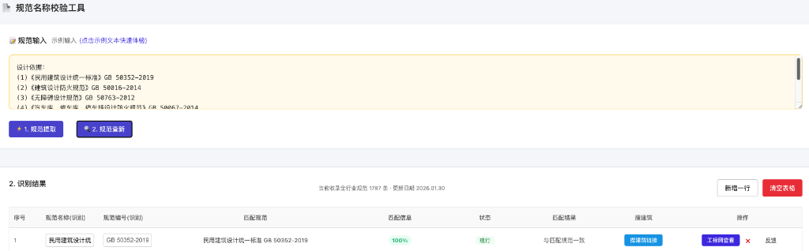

# 规范对比工具 (Standard Comparison Tool)

一个基于 AI 的建筑设计规范提取与查新工具，旨在帮助设计师快速校验设计说明中的规范引用是否符合最新现行标准。



## 主要功能 (Features)

*   **智能提取**: 使用正则表达式与 AI (DeepSeek/Gemini) 混合模式，从设计说明文本中自动提取规范及其编号。
*   **实时查新**: 对接工标网 (CSRES) 和本地数据库，实时检测规范的现行、废止或被替代状态。
*   **差异对比**: 自动比对设计说明中的版本与最新版本，高亮显示过期规范。
*   **一键导出**: 支持将查新结果导出，方便存档与修改。

## 技术栈 (Tech Stack)

*   **前端**: React, TypeScript, Vite
*   **后端**: Python, FastAPI
*   **数据库**: SQLite (本地缓存), SQLAlchemy
*   **AI 集成**: DeepSeek API / Google Gemini API

## 本地运行 (Development)

### 后端 (Backend)

```bash
cd backend
python -m venv venv
source venv/bin/activate  # Windows: venv\Scripts\activate
pip install -r requirements.txt
python run_server.py
```

服务运行在: `http://localhost:8012`

### 前端 (Frontend)

```bash
cd frontend
npm install
npm run dev
```

前端运行在: `http://localhost:5173`

## 环境变量 (Env Variables)

在 `backend` 目录下创建 `.env` 文件：

```ini
GEMINI_API_KEY=your_gemini_key
DEEPSEEK_API_KEY=your_deepseek_key
```


